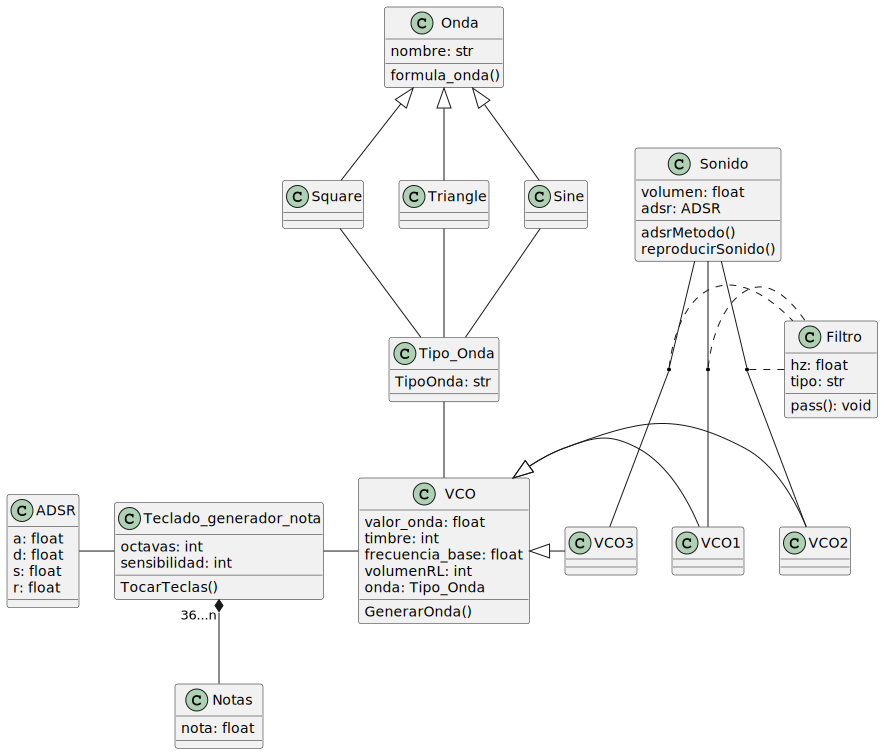

# Proyecto-Sintetizador

# Prueba de apartado funcional

Para hacer uso de la prueba disponible hay que hacer instalación de las siguientes librerías:

Sounddevice - Windows

py -#version   -m pip install sounddevice

Sounddevice - MAC

python#versionpython  -m pip install sounddevice

Numpy - Windows

py -#version   -m pip install numpy

Numpy - MAC

python#versionpython  -m pip install numpy

Hecho lo anterior y tras la ejecución del programa se le consultará al usuario en que octava desea ubicarse y se desplegará una pequeña interfaz la cual simula las teclas de una octava de un piano. 
Claramente al presionar alguna de las teclas se ejecutará un sonido correspondiente a la nota.
